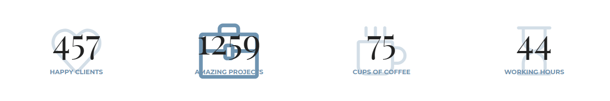

# kai-Progress-board
#### (Доска достижений компании на jQuery)
***
### Вы можете скачать "kai-Progress-board" Zip архивом.
[](https://github.com/AndreiKaragayr/kai-progress-board.git)

***
### Про библиотеку:
1. kai-Progress-board - это небольшая библиотека на jQuery, задача которой выводить достижения компании в виде счетчиков.
2. kai-Progress-board уже Adaptive и подстраивается под размер устройства.
3. Встроенная анимация в виде сигнала про достижение значения.
4. kai-Progress-board содержит настройки в файле `kai_progress_board.js`:
 - `timeCounter:` - время за которое счетчики достигнут значения
 - `iconFirst:` - иконка сердце
 - `iconSecond:` - иконка кейса
 - `iconThird:` - иконка чашки
 - `iconFourth:` - иконка часы
 - `colorIcon:` - цвет иконок
 - `colorTitle:` - цвет заголовков
 - `colorCount:` - цвет счетчиков 

  
#### В Area-scroll входит:
 - папка `css` - стили `kai_progress_board.css` и стили иконок `simple-line-icons.css`
 - папка `js` - библиотеки kai_progress_board и jquery v3
 - папка `fonts` - шрифты simple-line-icons
 - `demo.html` - презентационная версия библиотеки
 - `sampel.html` - простая структура
***

### Технические зависимости:
  + [jquery](https://jquery.com/)
  + [simple-line-icons](http://simplelineicons.com/)
  + шифт [Playfair Display](https://fonts.google.com/specimen/Playfair+Display)
  + шифт [Montserrat](https://fonts.google.com/specimen/Montserrat)

### Шаги по установке:
1. Скачать [zip архив](https://github.com/AndreiKaragayr/kai-progress-board.git) или клонировать  репозиторий себе на ПК
2. Скачиваем [jquery](https://jquery.com/) - без него магия не случится :)
3. На fonts.google.com качиваем Шрифты: Playfair Display и Montserrat (или копируем из demo.html `<link>`)
4. подключаем шрифты в свой `index.html`:
 - `<link href="https://fonts.googleapis.com/css?family=Playfair+Display:400,400i,700,700i" rel="stylesheet">`
 - `<link href="https://fonts.googleapis.com/css?family=Montserrat:400,700&amp;subset=cyrillic" rel="stylesheet">`
5. В `index.html` подключаем стили:
  + cтили иконок `<link rel="stylesheet" href="css/simple-line-icons.css">`
  + cтили Area-scroll `<link rel="stylesheet" href="css/kai_progress_board.css">`
6. В `index.html` подключаем JavaScript:
  + библиотека jquery `<script src="js/jquery-3.2.1.min.js"></script>`
  + библиотека slide Overla `<script src="js/kai_progress_board.js"></script>`
7. В `sample.html` можно посмотреть простую структуру html.

***
### Как с этим работать:

#### 1. kai-Progress-board содержит свои классы которых нужно придерживаться:
 - `class="kai-board"` - родительский блок
 - `class="wr-progress-board"` - сам счетчик 
 - `data-value=""` - атрибут `class="wr-progress-board"`, в нем значение счетчика
у нас получилась следующая структура:
```
<div class="kai-board">
	<div class="wr-progress-board" data-value="">
	</div>
</div>
```
#### 2. Наполнение
В блок `class="wr-progress-board"` напишем название счетчика например _"Чашек кофе"_ в атрибут `data-value` укажем количество чашек которое мы употребили, например _"44"_. Итак что у нас вышло:
```
<div class="kai-board">
	<div class="wr-progress-board" data-value="44">
		Чашек кофе
	</div>
</div>
```
Первый счетчик мы сделали, делаем еще 3 и все готово. **Всего должно быть 4 счетчика.**

***
Вот и все что нужно для работы данной библиотеки, если что то не получилось посмотрите  `demo.html`

